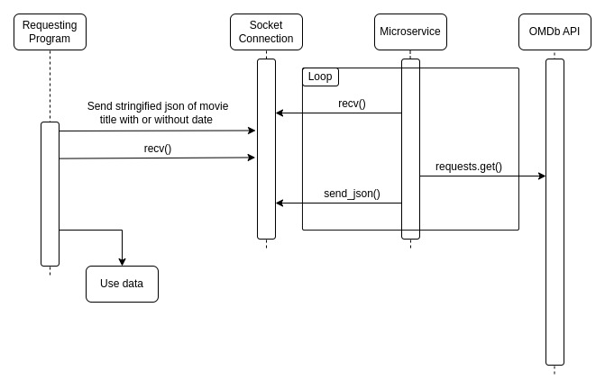

# CS361 Microservice for OMDb API
## Introduction
This is my microservice for CS361 at Oregon State University. It receives requests for movie information using messages sent via ZeroMQ. Requests are made by sending the title of the film to the microservice. The date can also be included to differentiate between remakes.

## Setup
The dependencies for this project are pretty minimal and you will probably already have all of them installed. If not, requirements.txt is available if you need to replicate the environment that I used for the project.

## Sending a request
Requests are as simple as creating a dictionary with the appropriate fields, converting it to a JSON string, and sending it to the service. After establishing a connection to the server, the following code can be used to send a request to the server.
```python
# Create request dictionary
request = {"Title": "Mission Impossible", "Year": "1996"}

# Convert dictionary to string
requestString = json.dumps(request)

# Send request
socket.send_string(requestString)
```
Requests can also be made without the year field. To do this, you can simply remove the year field from the dictionary.
```python
# Create request dictionary
request = {"Title": "Finding Nemo"}

# Convert dictionary to string
requestString = json.dumps(request)

# Send request
socket.send_string(requestString)
```
Both of these examples are included in client.py as a full example.

## Receiving a response
Receiving a response is also very simple. After sending a request we can simply wait for a response from the server using the following code.
```python
# Receive response and decode to a string
message = socket.recv().decode()

# Convert string into python dictionary
data = json.loads(message)
```

## Program structure
The microservice effectively converts a python dictionary into the appropriate API call for the OMDb database. The title and date are extracted from the request and inserted into the url. The program will then handle the API call if it is a new URL or used the cached response from previous, identical calls. From there it sends the data received from the database back to the requesting program. Below is a UML sequence diagram outlining the basic flow. 


